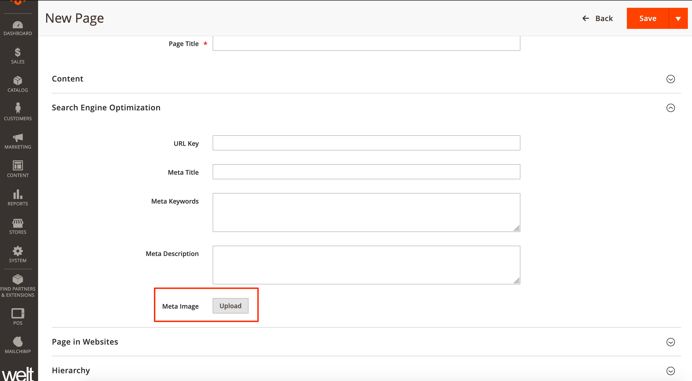

## SomethingDigital CMS Page Meta Image

Add Meta Image attribute to CMS Pages.

### Installation

1. Add repository to `composer.json`

   `composer config repositories.sd-cms-meta-image vcs https://github.com/sdinteractive/Magento2_SomethingDigital_CmsMetaImage.git`

1. Install via composer

   `composer require somethingdigital/module-cms-meta-image`

### Usage

The module adds an image uploader to the `Search Engine Optimization` section
of the CMS Page add/edit form. Use the uploader for uploading the desired meta
image for the CMS Page.

